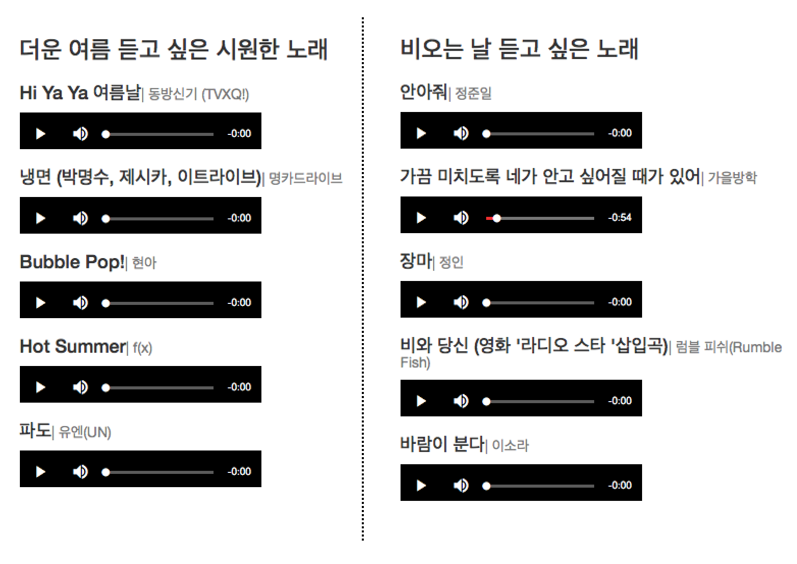
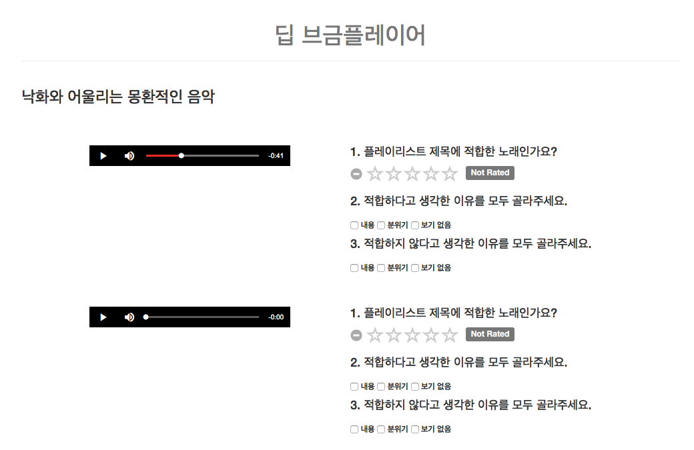

# deep-music-playlist-generation
> created on May 2017

## Authors
* [Jinhan Choi](https://github.com/jinhan) : Demo
* [Seonghyeon Kim](https://github.com/rosinality) : Model, descriptions

## Data
We used the [Music PD Albums](https://music.bugs.co.kr/musicpd) playlist of [Bugs!](https://music.bugs.co.kr/) to train our model. The number of the playlist was 14,967. Total vocabulary of characters in the title was 1,277. We choosed top most 3,000 frequent songs in the playlists and discarded the rest of the songs. After removing the rest of the songs in the playlist, we excluded the playlists with length less than 5. Total 5,180 playlist was left and we used 90% of the playlist as a training set and the remaining 10% of playlist as a validation set.

## Our Approach
We formulated the playlist generation task as a multi-label classification problem. Model assigns the probability of each songs in the song libraries on inputs, and select top k songs with the highest probability to make playlist.

To assign the probability of the songs, we used the title of the expert-crafted playlists as a feature. The title of the playlist summarize common features in the composition of playlists, so it can be used as a predictor of each songs. The title is encoded by the recurrent neural network in a character basis, and the final output of RNN is projected by multilayer feedforward neural networks to predict the probability of each song.

The characters in the title embedded to 100 dimensional vectors. we used standard bidirectional RNN with Long-Short Term Memory with cell size of 256 to encode titles. The final output of forward and backward RNN is concatenated, and projected by 3 layer feedforward neural networks with ReLU nonlinearity. The output of the feedforward neural network has the same dimensions with the number of songs in the library. Number of neurons in the 3 hidden layer was 512, and dropout with probability 0.5 applied after each hidden layer for better generalization.

The model was trained by Adam optimizer with learning 0.0003 and batch size was 16. Training was done with early stopping by tracking loss of the model on validation sets. The model was implemented using PyTorch 0.1.11.

## Screenshots

"What music do you want to listen to now?"

(ex, a song I want to hear in the hot summer, a song I want to hear on a rainy day)

Results

User evaluation
